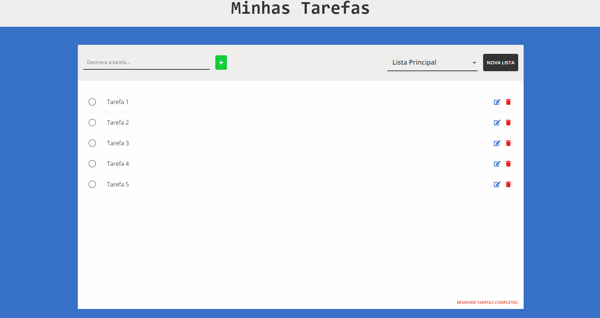

# To-Do-List

Aplicação para organização de tarefas pessoais com TypeScript e React. O usuário pode adicionar, remover e editar tarefas, existe uma lista principal/padrão, mas ele pode criar outras listas para dividir os tipos de tarefas, essas podem ser excluídas, caso o usuário queira, mas a lista principal não. Todos as tarefas e listas ficam salvas no local storage. Acesse o projeto [aqui](https://to-do-list2.vercel.app/).

Versão em [JS Puro e SASS](https://github.com/theandersonfonseca/To-Do-List).

